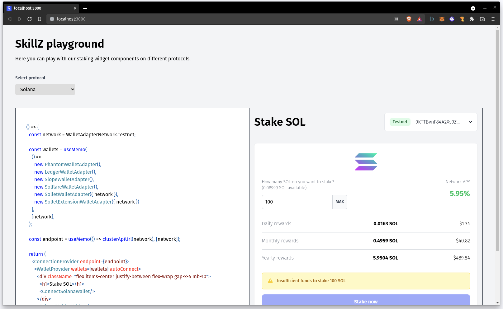
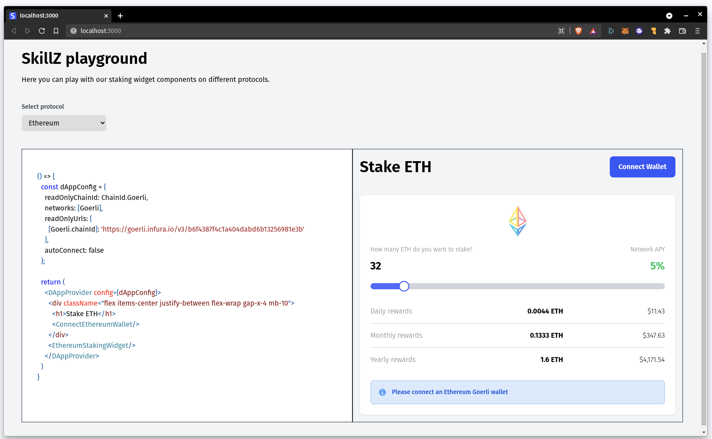

# SkillZ Playground

This is a React Playground to test the integration of SkillZ React Components.

## How to use it

```
npm install # install dependencies
npm run dev # run development server on http://localhost:3000
```

On the page, you can select among `Ethereum` and `Solana` examples.

## Solana Staking



## Ethereum Staking


